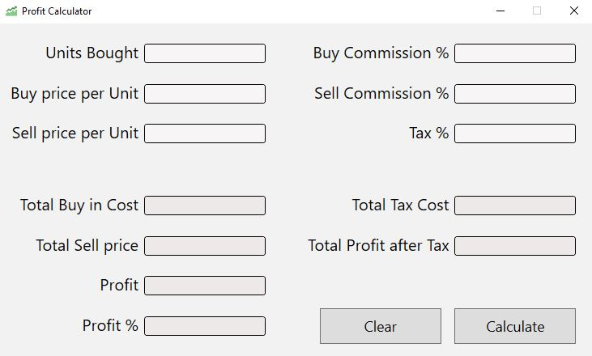

# Profit/Loss Calculator
```

Since I always found myself doing profit and loss calculations in Excel 
and constantly having to write the formulas over and over again, 
I thought I would make a simple C# WPF profit loss calculator to resolve my problem.

Implementing RegEx for input validation to the textboxes allowing only numbers and a maximum of 10 digits.

```

